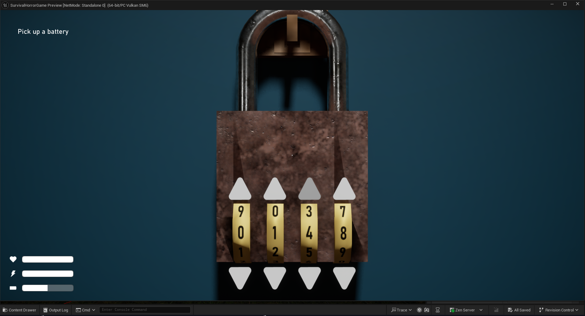

# Project First Person Horror: A Survival Horror Game Template

> **The "Make Your Own Pizza" Kit for Survival Horror Games**

## About This Project

Welcome to **Project First Person Horror**. This is not a finished game. It is a professional, robust, and highly modular template designed to be the foundation for your own survival horror creation.

Think of it like a pizza kit: the dough (core engine), the sauce (game loops), and the cheese (core mechanics) are all here and ready to go. Your job is to add the toppings—your unique story, art, level design, and creative flair—to bake your perfect game.

This template was built by [me](https://github.com/TirdadMH) to empower developers to skip the tedious and complex setup of core systems and jump straight into bringing their vision to life.

## Core Philosophy

This template is built on three key principles that define professional game architecture:

* **🧩 Modularity:** Systems are built as self-contained Components. The Health system can be attached to players, enemies, or even destructible objects. The Inventory system is a plug-and-play module. This makes the codebase clean, scalable, and easy to manage.
* **🔌 Loose Coupling:** Through extensive use of **Blueprint Interfaces** and **Event Dispatchers**, systems can talk to each other without being rigidly dependent. This means you can add, remove, or change features without causing a cascade of errors.
* **📊 Data-Driven Design:** Game balance and itemization are controlled through **Data Tables** and **Structs**. You can change enemy stats, define new items, or tweak crafting recipes in a spreadsheet without ever touching a line of code, dramatically speeding up iteration.

---

## Features & Included Mechanics

This template comes packed with a suite of professionally implemented, ready-to-use systems.

### 🧠 Artificial Intelligence

* **Hostile Stalker AI:** A formidable enemy AI built with Behavior Trees. It can seamlessly switch between states:
    * `Patrol`: Roams the environment along defined paths.
    * `Investigate`: Reacts to sounds or visual disturbances.
    * `Pursue`: Hunts the player relentlessly upon detection.
    * `Attack & Kill`: Engages the player in close quarters.
* **Ambient "Looker" AI:** A simpler AI type that only follows the player with its head. Perfect for creating unsettling atmosphere with non-hostile characters or mannequins.

### 🎒 Robust Inventory & Item System

A complete, component-based inventory system built from the ground up.
* **Data-Driven:** Each item's properties (name, description, icon, unique stats) are stored in a clean `Struct`, making adding new items effortless.
* **UI Included:** A fully functional inventory widget layout is ready to go.
* **Advanced Interactivity:** Features a dropdown menu on each item to `Examine`, `Use`, or `Drop`.
* **Expandable:** Includes a backpack item that correctly increases the available inventory slots.
* **Ready-to-Use Pickups:** Comes with essential pickups like door keys, flashlight batteries, and healing packages, all built on a master class for easy extension.
* **3D Examination:** All inventory items and world notes can be picked up and examined in a detailed 3D inspection environment.

### 🏃 Player & Movement Systems

* **Core Survival Mechanics:** Features a stamina-based sprinting system and health managed with consumable healing packages.
* **Dynamic Movement:** Includes crouching, immersive head-bobbing, and a tactical leaning mechanism to peek around corners or out of hiding spots.
* **Dynamic Footstep System:** Footstep sounds automatically change based on the physical material of the surface the player is walking on, enhancing immersion.

### 🌍 World Interaction & Immersion

* **Universal Interaction System:** A master interaction class allows any object to become interactable. Includes ready-made examples like light switches, doors, and lockers.
* **Puzzle-Ready Combination Lock:** A fully animated, interactive combination lock that can be used to gate progress.
* **Dynamic Notes System:** Place readable notes anywhere in the world. Each note is a separate instance, allowing you to reuse the system for any amount of narrative content.
* **Flickering Lights:** Two separate, performant implementations for creating spooky lighting effects: a dedicated flickering light actor and a dynamic light material.
* **Jumpscare Mechanic:** A dedicated system for triggering scripted jumpscares.

### 🎬 Narrative & UI

* **Objective System:** A flexible system to create and track player objectives and tasks.
* **Cutscene Player:** A built-in system for triggering in-game cinematic sequences.
* **Minimalist HUD:** A clean user interface to display the player's health, stamina, and flashlight battery level.

---

## How to Get Started: Making Your Pizza

Ready to start cooking? Here’s your guide to using this template.

### 1. The Base & Sauce (Project Setup)

* **Engine Version:** This project is built on Unreal Engine 5.6.
* **Required Plugins:** Ensure the `EnhancedInput` plugin is enabled.
* **Key Folders:**
    * `/Blueprints`: Contains all core gameplay Blueprints.
    * `/EnhancedInputs`: Home to all Input Actions and Mapping Contexts.
    * `/UMG`: Your Widget Blueprints and UI Assets live here.

### 2. Adding the Toppings (Creating Your Content)

This template is designed for extension through child classes and data.

* **To Create a New Item:**
    1.  Create a new Inventory Item that is a child of `BP_InventoryItem_Master`.
    2.  Set its unique logic and mesh.
    3.  Define Its logic functions which makes it an Inventory Item.
    4.  Place it in the world. It will automatically be interactable.

* **To Create a New Interactable Object:**
    1.  Create a new Blueprint that is a child of `BP_InteractionActor`.
    2.  Implement the `BPI_Interaction` interface logic for what happens when the player interacts with it.
    3.  Place it in the world. The system will handle the rest.

* **To Customize the AI:**
    1.  Open the `BT_Classic` Behavior Tree to see the main logic flow.
    2.  You can easily tweak values in the `BB_Classic` Blackboard (e.g., `SetSpeed`, ` CanSeePlayer`).
    3.  To create a new enemy type, duplicate the existing AI character and assign it a new Behavior Tree or modify its base stats.

### 3. Baking the Pizza (Building Your Game)

With the core mechanics in place, you can focus on what makes your game unique:
* **Level Design:** Build your world and place the interactive actors, items, and AI patrol paths.
* **Narrative:** Use the note system and objective data to tell your story.
* **Atmosphere:** Add your own sound, lighting, and post-process effects to create the perfect mood.

---

## Screenshots

| Feature | In-Game |
|---|---|
|  |  |
|  |  |

## License

This project is licensed under the **MIT License**. See the `LICENSE.md` file in the repository for the full license text.

In short, this license allows you to use, copy, modify, merge, publish, distribute, sublicense, and/or sell copies of this software for any purpose, including for commercial games, as long as you include the original copyright notice and license text in your project.

## Contact & Support

For questions or suggestions, you can reach me at mohamma.moa1381@gmail.com.

This project is open-source and contributions are always welcome! Feel free to fork the repository, make your own improvements, and submit a pull request for review.
